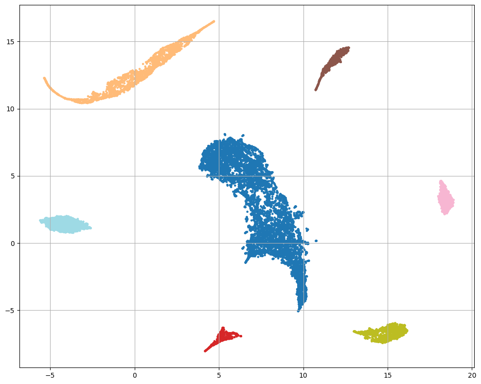

# ML 2025 Spring. Unsupervised

Решение в: **notebook_solution.ipynb**

## Поставленная задача
Вам предоставлен набор данных — некоторые вещественные признаки. Вам нужно проставить метки классов, другими словами, кластеризовать данные.

## Описание решения
Для предобработки данных я использовал StandardScaler без центрирования, т.к. иначе разреженная матрица перестанет быть разреженной.

Уменьшил размерность через TruncatedSVD до 50, т.к. при таком значении накопленная доля дисперсии всё ещё составляет примерно 0.99.

Далее я дважды понизил размерность через UMAP, чтобы более явно выделить близкие элементы и разделить более отдалённые. Гиперпараметры UMAP подбирал с помощью Optuna, максимизируя Silhouette Score.

Для кластеризации я использовал DBSCAN, т.к. он не требует заранее указывать количество кластеров и, судя по визуализации, наиболее корректно разделяет данные.

Данные с разными метками разбились на отдельные группы:

В результате я занял 29-е место из 60 участников на Kaggle.
